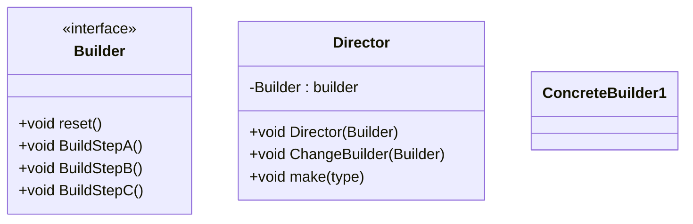

```mermaid
classDiagram

class Builder{
<<interface>> 
    +void reset()
    +void BuildStepA()
    +void BuildStepB()
    +void BuildStepC()
}

class Director{
-Builder : builder
+void Director(Builder)
+void ChangeBuilder(Builder)
+void make(type)
}

class ConcreteBuilder1{

}

```
