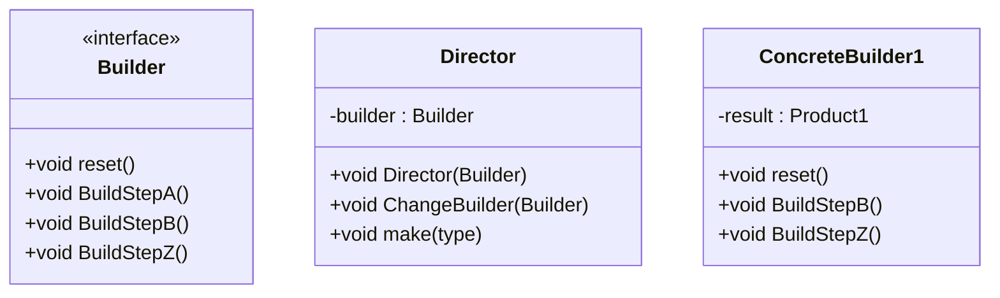

```mermaid
classDiagram

class Builder{
<<interface>> 
    +void reset()
    +void BuildStepA()
    +void BuildStepB()
    +void BuildStepZ()
}

class Director{
-builder : Builder
+void Director(Builder)
+void ChangeBuilder(Builder)
+void make(type)
}

class ConcreteBuilder1{
-result : Product1
+void reset()
+void BuildStepB()
+void BuildStepZ()

}

```
