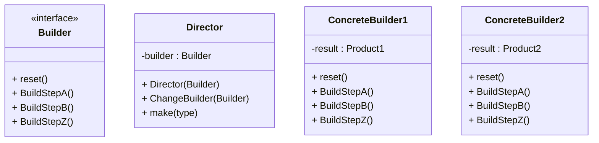

```mermaid
classDiagram

class Builder{
<<interface>> 
    + reset()
    + BuildStepA()
    + BuildStepB()
    + BuildStepZ()
}

class Director{
-builder : Builder
+ Director(Builder)
+ ChangeBuilder(Builder)
+ make(type)
}

class ConcreteBuilder1{
-result : Product1
+ reset()
+ BuildStepA()
+ BuildStepB()
+ BuildStepZ()

}

class ConcreteBuilder2{
-result : Product2
+ reset()
+ BuildStepA()
+ BuildStepB()
+ BuildStepZ()

}

```
